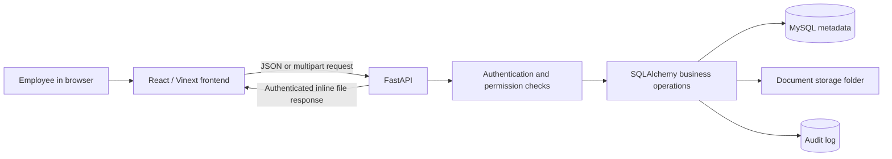
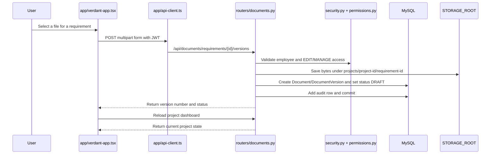
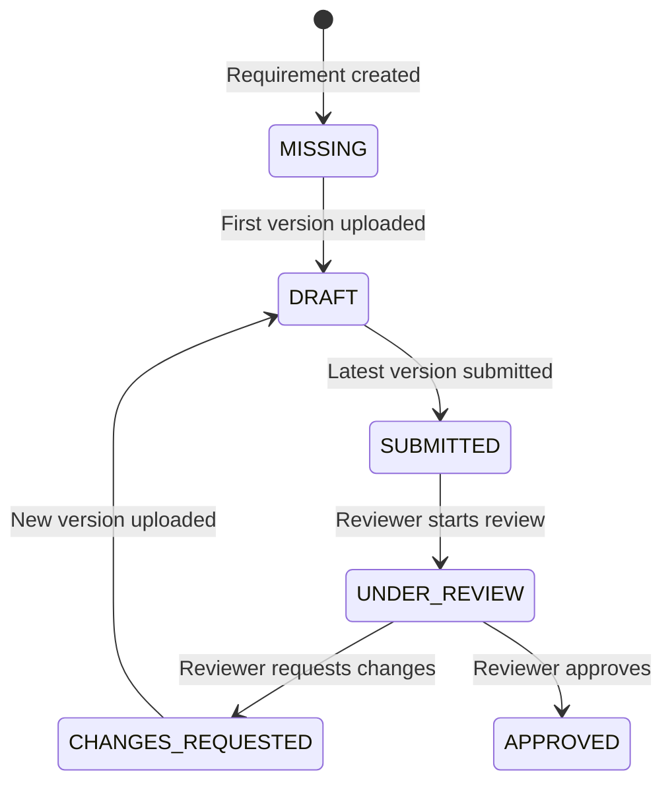

# Verdant Codebase and Application Guide

This handbook explains how the current Verdant prototype is organized, how a user action moves through the application, and where to make common changes. It describes the code as it exists on this branch; it is not a future design proposal.

For installation instructions, see [Local Windows Installation (No Docker)](LOCAL_INSTALLATION_WINDOWS.md). For the reasoning behind the database structure, see [Database review and implemented changes](schema-notes.md).

## 1. What Verdant is

Verdant is an internal document-management application with two related areas:

1. **Controlled project documents** — a project owner creates stages and required document slots, assigns a responsible employee and one reviewer, controls access, and tracks every uploaded version through review.
2. **Company research library** — authenticated employees upload files into nested classifications. Research does not use the project review workflow, but an administrator can add an endorsement badge and a research document can be linked to a project.

Verdant is deliberately not a project-planning system. A project is currently a container for lifecycle stages, document requirements, permissions, versions, and reviews. It can later be connected to a separate planning system.

## 2. The system at a glance



The browser never connects directly to MySQL or the document folder. It calls the FastAPI endpoints. FastAPI validates the signed-in employee and their permissions, reads or changes database rows, and reads or writes document files.

### Source-of-truth boundaries

- **MySQL** stores employees, projects, permissions, workflow status, version metadata, checksums, endorsements, and audit entries.
- **`STORAGE_ROOT`** stores the actual uploaded file bytes.
- **React state** holds the data currently displayed in one browser session. It is refreshed from FastAPI after actions.
- **Alembic migrations** define the installed database structure. The SQLAlchemy model describes the desired structure used by Python.

A database backup without the storage folder is incomplete, and a storage-folder backup without MySQL loses the document relationships and history. Back up both together.

## 3. Top-level folder map

```text
verdant-document-hub/
├── app/                         Active React application
├── components/ui/               Reusable visual controls
├── hooks/                       Shared React hooks
├── lib/                         Small frontend utilities
├── backend/
│   ├── app/                     FastAPI application
│   │   └── routers/             API endpoints grouped by feature
│   ├── alembic/                 Database migrations
│   ├── tests/                   Backend tests
│   ├── storage/                 Default development file storage
│   └── seed.py                  Optional demonstration records
├── docs/                        Project documentation and original diagram
├── public/                      Browser-served static files
├── package.json                 Frontend packages and commands
└── README.md                    Project introduction and quick start
```

## 4. A request from beginning to end

The project-document upload flow is a useful example:



Most modifying operations follow the same pattern:

1. A form or button handler in `app/verdant-app.tsx` calls `api()`.
2. `app/api-client.ts` adds the bearer token and sends the request.
3. A router function in `backend/app/routers/` validates the request.
4. `backend/app/security.py` identifies the employee.
5. `backend/app/permissions.py` applies project or document access rules when needed.
6. SQLAlchemy changes MySQL records; upload endpoints also write a file.
7. `write_audit()` adds an audit entry in the same database transaction.
8. The frontend reloads the project or workspace data and redraws the screen.

## 5. Frontend: what each important file does

### Active application files

| File | Responsibility | Change it when… |
|---|---|---|
| `app/page.tsx` | Root page entry point. It renders `VerdantApp`. | You want the root URL to render a different top-level component. |
| `app/layout.tsx` | HTML shell, fonts, page title, description, and global stylesheet import. | You change browser metadata, global fonts, or the application shell. |
| `app/verdant-app.tsx` | The current working UI and its client-side behavior: login, navigation, state, forms, API calls, projects, requirements, versions, review actions, research, search, audit display, and the file viewer. | You change a screen, button, form, displayed field, frontend workflow, or which endpoint is called. This is currently the main frontend file. |
| `app/api-client.ts` | Base API URL, JSON/multipart request handling, bearer-token header, API error extraction, and authenticated file downloads. | The API address, request headers, authentication transport, or error handling changes. |
| `app/globals.css` | Tailwind imports, color variables, typography, global styling, accessibility motion behavior, and login layout. | You change the overall visual theme or global CSS. |
| `components/ui/*.tsx` | Reusable shadcn/Base UI controls such as buttons, cards, dialogs, inputs, tables, tabs, and tooltips. | You need to change a control everywhere or add a reusable UI primitive. Prefer composing these from the feature UI instead of editing them for one screen. |
| `lib/utils.ts` | Shared frontend class-name helper used by UI controls. | The shared CSS-class merge behavior changes. |
| `hooks/use-mobile.ts` | Reusable mobile-screen detection hook. | Responsive logic needs a shared programmatic breakpoint. |

### Present but not used by the working page

The following files are remnants of the earlier visual-only prototype:

- `app/login.tsx`
- `app/project-views.tsx`
- `app/document-panels.tsx`
- `app/prototype-components.tsx`
- `app/prototype-data.ts`
- `app/research-audit-views.tsx`
- `app/use-prototype-tools.ts`

They import one another, but the active `app/page.tsx` → `app/verdant-app.tsx` path does not import them. Editing them will not change the current application. Before reusing or deleting them, confirm with an import search such as:

```powershell
rg "prototype-data|project-views|document-panels" app
```

### Frontend configuration files

| File | Responsibility |
|---|---|
| `package.json` | Node version requirement, frontend dependencies, and `dev`, `build`, `start`, `lint`, and `format` commands. |
| `package-lock.json` | Exact dependency versions installed by `npm ci`. Commit it when dependencies change. Do not hand-edit it. |
| `vite.config.ts` | Connects Vinext and Tailwind to Vite. |
| `next.config.ts` | Next-compatible configuration consumed by Vinext; currently has no custom settings. |
| `tsconfig.json` | TypeScript strictness, module handling, included files, and the `@/*` path alias. |
| `components.json` | shadcn component style and import aliases. |
| `.oxlintrc.json` | Frontend lint configuration. |
| `.oxfmtrc.json` | Frontend formatting configuration. |
| `.env.local` | Local frontend API URL. It is intentionally ignored by Git and must not contain committed secrets. |

## 6. Backend: what each important file does

### FastAPI foundation

| File | Responsibility | Change it when… |
|---|---|---|
| `backend/app/main.py` | Creates FastAPI, configures CORS, mounts every router under `/api`, and exposes `/api/health`. | You add a router, middleware, API-wide behavior, or service metadata. |
| `backend/app/config.py` | Loads `DATABASE_URL`, JWT settings, storage path, frontend origin, and other settings from `backend/.env`. It also creates the storage root if missing. | You add a backend environment setting or change a default. |
| `backend/app/db.py` | Creates the SQLAlchemy engine, model base, connection/session factory, and per-request database dependency. | You change database engine or session behavior. |
| `backend/app/models.py` | SQLAlchemy tables, columns, relationships expressed through foreign keys, enums, indexes, unique rules, and database checks. | Persistent data or a database rule changes. A matching Alembic migration is also required. |
| `backend/app/schemas.py` | Pydantic request and response shapes used at the API boundary. | An endpoint accepts or returns a new field. |
| `backend/app/security.py` | Argon2 password hashing, JWT creation/validation, and lookup of the active employee for authenticated requests. | Login tokens, password rules, token duration, or identity integration changes. |
| `backend/app/permissions.py` | Reusable project-owner, project-member, and document-specific access checks. | Authorization rules or the meaning of access levels changes. |
| `backend/app/audit.py` | Adds an `AuditLog` row to the current transaction. | The common audit-record format changes. Feature-specific action names remain in their routers. |

### API routers

| File | Main endpoints and behavior |
|---|---|
| `backend/app/routers/auth.py` | Employee ID/password login, current employee lookup, and active employee listing. |
| `backend/app/routers/projects.py` | Accessible project list, project creation, lifecycle template list, project dashboard, members, project-specific stages, required documents, assignments, and document-specific permissions. |
| `backend/app/routers/documents.py` | Project-document version upload, submission, review start/decision, version history, authenticated inline viewing, and recoverable requirement archiving. |
| `backend/app/routers/research.py` | Nested classifications, research listing/upload/versioning, authenticated viewing, project linking, administrator endorsement, and recoverable archiving. |
| `backend/app/routers/search.py` | Metadata search across accessible project documents and all active research documents, plus global or project-filtered audit retrieval. |
| `backend/app/routers/__init__.py` | Marks the router directory as a Python package. |

The router files currently contain both HTTP handling and most business logic. There is no separate service layer yet. For a larger second version, extracting business operations into `services/` would make the routers shorter and easier to test.

### Backend support files

| File | Responsibility |
|---|---|
| `backend/pyproject.toml` | Required Python version, backend dependencies, test dependencies, packaging, and pytest settings. |
| `backend/.env.example` | Safe template for local backend configuration. Copy it to `backend/.env`; never commit the real secret file. |
| `backend/seed.py` | Creates demo employees, lifecycle template, Project X, permissions, sample PDFs, review history, research, endorsement, and an initial audit event. |
| `backend/tests/test_security.py` | Confirms passwords are hashed and can be verified correctly. |
| `backend/tests/test_seed_pdf.py` | Confirms the tiny PDF generator used by the demo seed creates a valid PDF container. |
| `backend/storage/.gitkeep` | Keeps the otherwise empty default storage directory in Git. Uploaded files in this folder are ignored. |

## 7. Database model in plain language

### People, projects, and access

- `employees` is the login identity and employee directory. Passwords are stored as hashes, never plain text.
- `projects` stores the document container and its owner.
- `project_members` grants an employee access across a project at `VIEW`, `EDIT`, `REVIEW`, or `MANAGE` level.
- `document_permissions` grants an employee access to one required document. This is intended for document-only access such as a visitor.
- Administrators and the project owner bypass ordinary project/document checks.

### Project lifecycle and controlled documents

- `lifecycle_templates` and `lifecycle_template_stages` hold a reusable company standard.
- Creating a project copies template stages into `project_stages`, allowing the new project to customize its stages without changing the template.
- `document_types` names a category such as “Technical drawing.” It is project-specific in the current UI.
- `document_requirements` is the checklist slot: what the project needs, in which stage, with which responsible employee, reviewer, due date, and status.
- `documents` represents the document belonging to that slot. One requirement can have at most one document.
- `document_versions` contains immutable version metadata and the path to each stored file.
- `document_reviews` ties one reviewer decision and comment to one exact version.
- `document_type_dependencies` exists in the database model for future dependency rules, but the current API and UI do not yet manage or enforce it.

### Research library

- `research_categories` is a self-referencing tree. `parent_id` creates sub-classifications.
- `research_documents` stores a research record.
- `research_document_versions` stores each uploaded version and file path.
- `research_endorsements` is a trust signal from an administrator; it does not control workflow or access.
- `project_research_links` connects research to a project without turning it into a controlled project requirement.

### Traceability

- `audit_logs` records the employee, action name, entity type/id, optional details, and time.
- File-version records store a SHA-256 checksum so later integrity checks can detect changed bytes.
- Archive timestamps preserve records instead of immediately deleting them.

## 8. Permissions as currently enforced

| Actor/access | Project visibility | Project document actions | Project administration | Research |
|---|---|---|---|---|
| Administrator | All active projects | All document actions and reviews | Allowed | View/upload; can endorse |
| Project owner | Owned project | All document actions | Members, stages, requirements, assignments, document permissions | Same as employee; can link visible research to owned project |
| `MANAGE` member | Project visible | View/upload/submit through allowed access checks | Does not receive owner-only controls | Same as employee |
| `EDIT` member or responsible employee | Project visible | View, upload a new version, submit latest version | No | Same as employee |
| `REVIEW` member or assigned reviewer | Project visible | View; assigned reviewer can start/decide their review | No | Same as employee |
| `VIEW` member | Project visible | View | No | Same as employee |
| Document-specific permission | Direct access to that requirement according to its level | Limited to that requirement | No | Same as employee |

The project owner is the only ordinary employee allowed to manage project membership, stages, requirements, assignments, and document permissions. The `is_admin` flag acts as the senior/system administrator role.

## 9. Controlled document workflow



Important details:

- The responsible employee and reviewer must be different. This is checked in the API and with a MySQL check constraint.
- The assigned people must be project members, except the project owner who is inherently allowed.
- Only the newest version can be submitted.
- Submission requires an assigned reviewer and creates the version-specific review record.
- A new version after changes were requested returns the requirement to `DRAFT`.
- The UI currently starts the review immediately before saving the reviewer’s decision; it does not expose “start review” as a separate user step.
- “New version submitted” is a business description, not a separate stored status. The stored transitions are `CHANGES_REQUESTED → DRAFT → SUBMITTED`.

## 10. Authentication and file viewing

1. The login form posts the employee code and password to `/api/auth/login`.
2. FastAPI verifies the Argon2 hash and returns a signed JWT containing the employee database ID and expiration.
3. The frontend stores the JWT in browser `localStorage` under `verdant_token`.
4. `api-client.ts` sends it as `Authorization: Bearer ...` on later API and file requests.
5. File endpoints repeat the permission check before returning an inline response.
6. The frontend converts the authenticated file response into a temporary browser object URL and displays it in an `iframe`.

The browser determines which formats it can preview. PDF and browser-supported media/text usually display inline; formats such as some office documents may download or fail to render without a later conversion service.

## 11. Search and audit behavior

Current search is metadata search. It uses SQL `LIKE` against:

- project requirement title and description;
- project document type name;
- research document name and description; and
- research classification name.

Project results are restricted to projects the employee owns or belongs to. Active research results are company-wide for any authenticated employee. File contents, embeddings, semantic/topic matching, and OCR are not implemented yet.

Most write operations call `write_audit()` before committing. Because the audit row uses the same SQLAlchemy session, the business change and audit row are normally committed together.

## 12. Where to make common changes

| Desired change | Main files | Also check |
|---|---|---|
| Change wording, layout, buttons, or forms | `app/verdant-app.tsx` | `app/globals.css`, `components/ui/` |
| Change the color theme or global spacing | `app/globals.css` | Tailwind classes in `app/verdant-app.tsx` |
| Change the API server URL | `.env.local` | `app/api-client.ts`, `backend/.env` CORS origin |
| Add a field to an existing feature | `backend/app/models.py`, `backend/app/schemas.py`, relevant router, `app/verdant-app.tsx` | New Alembic migration, seed data, tests |
| Add a new API feature | New or existing file under `backend/app/routers/` | Register a new router in `backend/app/main.py`; add schemas, permission checks, audit, tests, and frontend call |
| Change project access rules | `backend/app/permissions.py` | Router-specific owner/reviewer checks and UI visibility (`canManage`) |
| Change login or token behavior | `backend/app/security.py`, `backend/app/routers/auth.py` | `backend/app/config.py`, `app/api-client.ts`, login code in `app/verdant-app.tsx` |
| Add or change a document status | `backend/app/models.py` | Migration, `routers/documents.py`, schemas, frontend status styling/actions, seed data, tests |
| Change the review sequence | `backend/app/routers/documents.py` | Model constraints, audit actions, frontend action buttons, tests |
| Change file-storage location | `backend/.env` | Folder permissions and backup process; no code change is normally needed |
| Add file size/type validation | `backend/app/routers/documents.py`, `backend/app/routers/research.py` | User-facing errors in `app/api-client.ts`/UI and tests |
| Change research categories or behavior | `backend/app/routers/research.py` | Research models/schemas, frontend research forms, migrations if persistent shape changes |
| Improve search | `backend/app/routers/search.py` | Database indexes/migration, result types and search UI |
| Change demo users or Project X | `backend/seed.py` | Installation guide if credentials change |
| Change database structure | `backend/app/models.py` | Generate and review an Alembic migration; update schemas, routers, seed, tests, and docs |

### Example: adding one database-backed field

Suppose a requirement needs a new “department” field:

1. Add the column to `DocumentRequirement` in `backend/app/models.py`.
2. Add it to the relevant Pydantic request/response shapes in `backend/app/schemas.py`.
3. Read/write it in `backend/app/routers/projects.py`.
4. Generate and review a new Alembic migration; never edit the already-applied initial migration for a deployed database.
5. Add the frontend type, form input, request value, and display in `app/verdant-app.tsx`.
6. Update `backend/seed.py` if demo data should contain the field.
7. Add tests and run the verification commands.

This end-to-end checklist prevents a common error where the UI knows about a field but the API or database does not, or vice versa.

## 13. Database migration workflow

After changing `backend/app/models.py`:

```powershell
Set-Location backend
.\.venv\Scripts\alembic.exe revision --autogenerate -m "describe the change"
```

Open the newly created file under `backend/alembic/versions/` and review both `upgrade()` and `downgrade()`. Autogeneration is a starting point, not automatic approval.

Then apply and verify it:

```powershell
.\.venv\Scripts\alembic.exe upgrade head
.\.venv\Scripts\alembic.exe check
```

For any database containing important information, back up MySQL and the document-storage folder first. Do not rewrite an old migration that other installations may already have applied; create a new migration.

### Migration files

- `backend/alembic.ini` configures Alembic paths and logging.
- `backend/alembic/env.py` loads the application `DATABASE_URL` and SQLAlchemy metadata.
- `backend/alembic/versions/1d68f13761f0_initial_document_hub_schema.py` creates the first complete schema.
- `backend/alembic/script.py.mako` is the template used for new revision files.

## 14. API route map

All routes except `/api/health` require a bearer token unless stated otherwise.

| Method and route | Purpose |
|---|---|
| `GET /api/health` | Basic service check; no login required. |
| `POST /api/auth/login` | Verify employee credentials and return a JWT. |
| `GET /api/auth/me` | Return the signed-in employee. |
| `GET /api/auth/employees` | List active employees for assignment forms. |
| `GET /api/projects` | List projects visible to the employee. |
| `POST /api/projects` | Create a project owned by the signed-in employee. |
| `GET /api/projects/templates` | List reusable lifecycle templates and stages. |
| `GET /api/projects/{id}/dashboard` | Return the project, stages, members, requirements, latest versions, reviews, and progress. |
| `POST /api/projects/{id}/members` | Add/update a project member; owner/admin only. |
| `POST /api/projects/{id}/stages` | Add a project-specific stage; owner/admin only. |
| `POST /api/projects/{id}/requirements` | Add a required document slot; owner/admin only. |
| `PATCH /api/projects/requirements/{id}/assign` | Change responsible employee/reviewer; owner/admin only. |
| `PUT /api/projects/requirements/{id}/permissions` | Add/update document-specific access; owner/admin only. |
| `POST /api/documents/requirements/{id}/versions` | Upload a new project-document version. |
| `POST /api/documents/versions/{id}/submit` | Submit the newest version for review. |
| `POST /api/documents/reviews/{id}/start` | Move an assigned review to under review. |
| `POST /api/documents/reviews/{id}/decision` | Approve or request changes with a comment. |
| `GET /api/documents/{id}/versions` | Return version history. |
| `GET /api/documents/files/project/{version_id}` | Return an authorized project file inline. |
| `DELETE /api/documents/requirements/{id}` | Soft-archive a required document; owner/admin only. |
| `GET/POST /api/research/categories` | List or create research classifications. |
| `GET/POST /api/research` | List or upload research documents. |
| `POST /api/research/{id}/versions` | Upload another research version. |
| `GET /api/research/files/{version_id}` | Return an authenticated research file inline. |
| `POST /api/research/{id}/links` | Link research to a project the employee can access. |
| `POST /api/research/{id}/endorse` | Add/update an administrator endorsement. |
| `DELETE /api/research/{id}` | Soft-archive research; uploader/admin only. |
| `GET /api/search?q=...` | Search accessible project metadata and active research metadata. |
| `GET /api/audit` | Global audit for administrators. |
| `GET /api/audit?project_id=...` | Audit rows associated with an accessible project. |

The live, interactive version of this table is available at `http://localhost:8000/api/docs` while FastAPI is running.

## 15. Running checks before committing a change

From the repository root:

```powershell
npm run lint
npm run build
Set-Location backend
.\.venv\Scripts\python.exe -m pytest
.\.venv\Scripts\alembic.exe check
```

`alembic check` requires access to the configured MySQL database. A successful frontend build does not test backend behavior, and the current backend tests cover only password hashing and demo-PDF generation. Add feature tests as the application grows.

## 16. Current prototype limitations to remember

These are important when planning changes:

- The active frontend is a large single component. Splitting it into feature components is a sensible future refactor, but should be done separately from business-feature changes.
- The older prototype UI files listed above are inactive and can confuse maintenance.
- Employees are read from the database, but there is no employee administration UI/API. Demo employees come from `seed.py`; a future company version should integrate the real employee identity source.
- JWTs are stored in browser `localStorage`. A production security review may prefer secure cookies or company single sign-on.
- Upload endpoints read the entire file into memory and do not yet enforce a maximum size or allowlist of file types.
- Files live on one configured filesystem. Multiple backend servers would require shared/object storage and a coordinated backup design.
- Browser preview is format-dependent; office-format conversion is not implemented.
- Search covers metadata only and uses simple SQL matching. It does not search inside files or understand topics.
- There is no email, chat, or push notification service for review assignments yet.
- Research is visible to every authenticated employee. There are no private research classifications in this version.
- A document-specific visitor can pass the backend check for a known document, but the current project list is based on ownership/membership; a dedicated shared-document inbox is still needed for a complete visitor experience.
- Soft-archive endpoints exist, but restore screens/endpoints are not yet implemented.
- `document_type_dependencies` is reserved in the schema but not yet enforced by the UI or API.
- The automated test suite is intentionally small and should gain API, permission, workflow, and migration tests before production use.

## 17. Safe change checklist

Before changing code:

1. Pull the current branch and create a feature branch.
2. Identify the frontend, schema, router, permission, and migration impact using the table above.
3. Back up real data before any migration or storage change.

Before committing:

1. Exercise the feature using at least the owner, responsible employee, reviewer, and visitor roles when access is involved.
2. Confirm unauthorized employees receive a rejection, not merely a hidden button.
3. Confirm the relevant audit event is written.
4. Run lint, build, backend tests, and the Alembic check.
5. Update this handbook when the architecture, active files, workflows, or change locations move.

The key maintenance rule is: **the backend is the authority**. Frontend button visibility improves usability, but FastAPI permission checks and database constraints must enforce the real rules.
