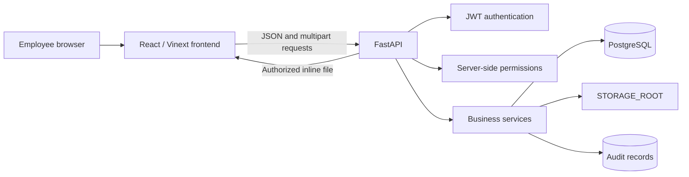
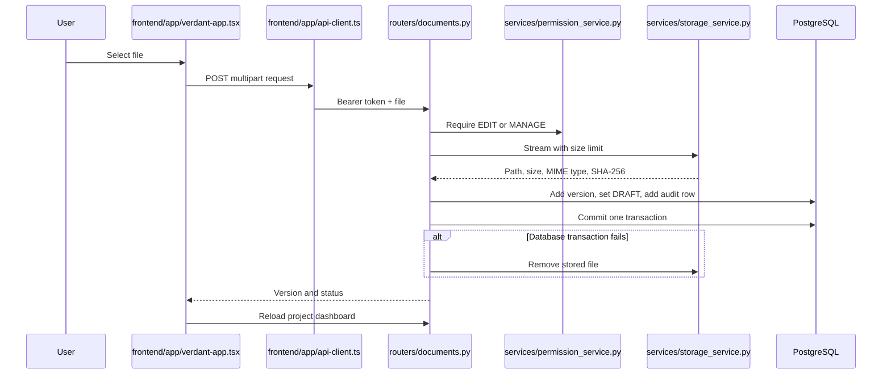
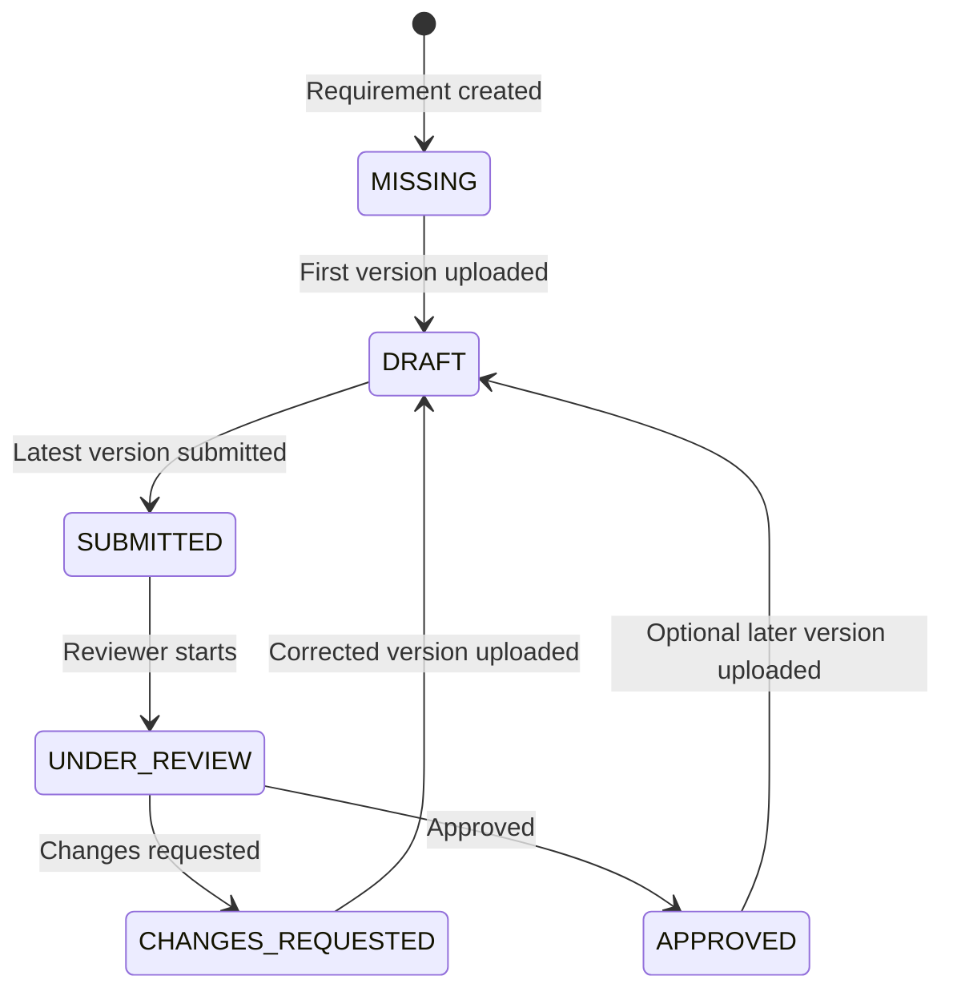

# Verdant Codebase and Application Guide

This handbook explains the PostgreSQL product architecture, how a browser action moves through Verdant, and where to make common changes. It describes the code on the `product-architecture-postgresql` branch.

Related documents:

- [Docker-free Windows installation](LOCAL_INSTALLATION_WINDOWS.md)
- [MySQL employee migration](MYSQL_TO_POSTGRESQL_MIGRATION.md)
- [Database design decisions](schema-notes.md)

## 1. Product boundary

Verdant has two document areas:

1. **Controlled project documentation** — project lifecycle stages, required document slots, responsible employees, reviewers, permissions, immutable versions, decisions, and audit history.
2. **Company research library** — nested classifications, employee uploads, versions, endorsements, and optional project links without the controlled review workflow.

A Verdant project is a document-governance container. Scheduling, budgets, tasks, and project planning belong to a separate future product or integration.

## 2. Runtime architecture



The frontend never connects directly to PostgreSQL or the storage folder. FastAPI is the security boundary and source of authorization decisions.

### Sources of truth

- PostgreSQL stores identity, projects, requirements, access, workflow status, file metadata, checksums, review history, research metadata, and audit history.
- `STORAGE_ROOT` stores uploaded file bytes.
- Alembic records the PostgreSQL schema version.
- React state is temporary display state and is refreshed from FastAPI.
- Future embeddings will be derived indexes, not the authoritative document data.

Back up PostgreSQL and `STORAGE_ROOT` together.

## 3. Repository structure

```text
verdant-document-hub/
├── backend/
│   ├── alembic/
│   │   ├── env.py
│   │   └── versions/0001_postgresql_baseline.py
│   ├── app/
│   │   ├── core/
│   │   │   ├── config.py
│   │   │   ├── database.py
│   │   │   └── security.py
│   │   ├── models/
│   │   │   ├── common.py
│   │   │   ├── enums.py
│   │   │   ├── employee.py
│   │   │   ├── project.py
│   │   │   ├── document.py
│   │   │   ├── research.py
│   │   │   └── audit.py
│   │   ├── schemas/
│   │   ├── routers/
│   │   ├── services/
│   │   └── main.py
│   ├── scripts/
│   ├── tests/
│   ├── .env.example
│   ├── alembic.ini
│   └── pyproject.toml
├── frontend/
│   ├── app/
│   │   ├── features/auth/login-view.tsx
│   │   ├── api-client.ts
│   │   ├── domain-types.ts
│   │   ├── presentation.ts
│   │   ├── verdant-app.tsx
│   │   ├── layout.tsx
│   │   └── page.tsx
│   ├── components/ui/
│   ├── hooks/
│   ├── lib/
│   ├── public/
│   ├── .env.example
│   └── package.json
└── docs/
```

There are no Docker runtime files on this branch.

## 4. Request flow

A project-document upload shows the normal pattern:



Most requests follow this order:

1. A React event handler calls `api()` or `fileBlob()`.
2. `api-client.ts` adds the JWT bearer token.
3. A FastAPI router validates the HTTP request.
4. `core/security.py` loads the active employee.
5. `permission_service.py` enforces server-side access.
6. A service or router changes PostgreSQL and, for uploads, storage.
7. `audit_service.py` adds the trace record to the same transaction.
8. The frontend refreshes authoritative data and redraws.

## 5. Frontend files

| File | Responsibility | Change it when… |
|---|---|---|
| `frontend/app/page.tsx` | Root route; renders Verdant. | The root page changes. |
| `frontend/app/layout.tsx` | HTML shell, metadata, fonts, global CSS. | Title, metadata, fonts, or global shell changes. |
| `frontend/app/verdant-app.tsx` | Authenticated workspace state, API actions, navigation, project/research/audit screens, forms, file viewer. | A main workflow, screen, button, or endpoint call changes. |
| `frontend/app/features/auth/login-view.tsx` | Employee ID/username login screen. | Login presentation or fields change. |
| `frontend/app/domain-types.ts` | Frontend representations of API data. | The backend response shape changes. |
| `frontend/app/presentation.ts` | Status labels and status color mapping. | A status name or visual treatment changes. |
| `frontend/app/api-client.ts` | API base URL, bearer token, JSON/form requests, errors, authenticated file blobs. | Transport, token header, base URL, or error handling changes. |
| `frontend/app/globals.css` | Tailwind imports, design tokens, global theme, login layout. | Product-wide appearance changes. |
| `frontend/components/ui/*.tsx` | Shared shadcn/Base UI primitives. | A reusable control changes everywhere. Avoid editing for one feature. |
| `frontend/package.json` | Node requirement, packages, build/lint/start commands. | A frontend dependency or command changes. |
| `frontend/.env.local` | Local API URL; ignored by Git. | Backend address changes. |

`verdant-app.tsx` is still the largest frontend file. Authentication and domain types are already extracted; future feature work should continue by moving project, research, audit, and file-viewer sections into their own feature components without changing behavior at the same time.

## 6. Backend foundation

| File | Responsibility |
|---|---|
| `backend/app/main.py` | Creates FastAPI, CORS, routes, OpenAPI, and health endpoint. |
| `backend/app/core/config.py` | Reads separate PostgreSQL settings and safely constructs the SQLAlchemy URL. Also reads JWT, storage, upload limit, and frontend origin settings. |
| `backend/app/core/database.py` | SQLAlchemy engine, session factory, and request database dependency. |
| `backend/app/core/security.py` | Argon2 hashing, JWT creation/validation, and active-employee lookup. |
| `backend/pyproject.toml` | Python packages, packaging discovery, pytest, Ruff formatting, and lint rules. |

The runtime account uses only `VERDANT_DB_*`. PostgreSQL administrator credentials are not application settings.

## 7. SQLAlchemy model packages

| File | Tables |
|---|---|
| `models/common.py` | Declarative base, constraint naming convention, shared creation timestamp. |
| `models/enums.py` | Access level, requirement status, and review decision values. |
| `models/employee.py` | `employees`; employee code, username, password hash, organization fields, JSONB profile data, admin/active flags. |
| `models/project.py` | Lifecycle templates/stages, projects, project members, project-specific stages. |
| `models/document.py` | Document types/dependencies, requirements, document permissions, logical documents, versions, and version-specific reviews. |
| `models/research.py` | Nested research categories, documents, versions, endorsements, and project links. |
| `models/audit.py` | Audit records with direct project scope. |
| `models/__init__.py` | Stable exports used by routers, services, Alembic, scripts, and tests. |

Persistent field changes require both a model change and a new Alembic migration.

## 8. Pydantic schema packages

Schemas are API contracts, not database tables:

- `schemas/auth.py` — login, employee output, token output.
- `schemas/project.py` — projects, membership, stages, assignments, requirements, document permissions.
- `schemas/document.py` — review decisions.
- `schemas/research.py` — categories, project links, endorsements.
- `schemas/search.py` — search results.
- `schemas/common.py` — reusable base/message structures.
- `schemas/__init__.py` — stable imports for routers.

When a request or response gains a field, update its schema even if the database already has the column.

## 9. Services and routers

### Services

| File | Responsibility |
|---|---|
| `services/auth_service.py` | Finds an active employee by employee code or username and verifies the hash. |
| `services/permission_service.py` | Owner, project-member, responsible employee, reviewer, and document-specific checks. |
| `services/project_service.py` | Shared assignment validation and employee serialization. |
| `services/storage_service.py` | Streams uploads, enforces `MAX_UPLOAD_SIZE_MB`, calculates SHA-256, publishes atomically, and removes files after failed DB transactions. |
| `services/audit_service.py` | Adds an audit record to the caller’s transaction. |

### Routers

| File | Responsibility |
|---|---|
| `routers/auth.py` | Login, current employee, employee selection list. |
| `routers/projects.py` | Projects, templates, dashboard, members, stages, requirements, assignments, permissions, and document-only shares. |
| `routers/documents.py` | Version upload, submission, review start/decision, history, viewing, and requirement archive. |
| `routers/research.py` | Categories, research upload/versioning/viewing, linking, endorsement, and archive. |
| `routers/search.py` | PostgreSQL metadata search and project/global audit retrieval. |

Routers own HTTP behavior. Reusable business rules, storage, permissions, authentication, and auditing belong in services.

## 10. PostgreSQL data model in plain language

### Employees and access

- `employees` is the authoritative Verdant identity table.
- `employee_code` and optional `username` can be used to sign in.
- Passwords are Argon2 hashes; plain text is never stored.
- `profile_data` is PostgreSQL JSONB for migrated company-specific fields. Fields used for authorization, filtering, or joining should become normal migrated columns.
- `is_active=false` blocks login while preserving historical ownership, uploads, reviews, and audit references.
- `project_members` grants whole-project access.
- `document_permissions` grants access to one required document.

### Project documentation

- A template is copied into project stages when a project is created.
- A requirement is the expected document slot in a stage.
- One logical document belongs to that requirement.
- Each upload creates a new immutable version row and stored file.
- A review belongs to one exact version.
- Responsible employee and reviewer must be different.

### Research

- Categories form a tree through `parent_id`.
- Research documents have immutable versions.
- Endorsements are trust signals, not workflow approval.
- A project link references research without converting it to a controlled requirement.

### Audit and files

- Audit rows identify the actor, project, action, entity, structured details, and time.
- Version rows store file path, MIME type, size, original name, and SHA-256.
- Archive timestamps preserve recoverable records.

## 11. Permissions

| Actor | Project access | Document work | Management | Research |
|---|---|---|---|---|
| Administrator | All active projects | All document/review actions | All owner actions | View/upload/endorse/archive |
| Project owner | Owned project | Full access | Members, stages, requirements, assignments, document permissions | Normal research access and project links |
| `MANAGE` member | Project visible | View/upload/submit where allowed | Not owner-only administration | Normal research access |
| `EDIT` member or responsible employee | Project visible | View, upload, submit latest version | No | Normal research access |
| `REVIEW` member or assigned reviewer | Project visible | View; assigned reviewer decides review | No | Normal research access |
| `VIEW` member | Project visible | View | No | Normal research access |
| Document-specific share | Listed by `/projects/shared-documents` | Only that requirement at granted level | No | Normal research access |

Frontend button visibility is only usability. The backend permission service and router-specific reviewer/owner checks are the authority.

## 12. Controlled document state flow



Rules enforced by FastAPI:

- An assigned reviewer is required before submission.
- Only the newest version can be submitted.
- Submission is allowed only from draft/change-request context.
- Only the assigned reviewer or administrator can start/decide a review.
- A decision requires an under-review document.
- The responsible employee and reviewer cannot be the same person.

## 13. Authentication and viewing

1. The frontend sends the entered employee code/username and password to `/api/auth/login`.
2. FastAPI verifies the employee is active and checks the password hash.
3. FastAPI returns a signed, expiring JWT.
4. The browser stores it under `verdant_token` and sends it as a bearer token.
5. File endpoints repeat authorization before returning inline content.
6. The frontend creates a temporary object URL and displays it in an `iframe`.

Browser preview still depends on the file type. PDF normally displays inline; some office formats will require a future server-side conversion/preview service.

## 14. Search and future embeddings

Current search uses PostgreSQL case-insensitive metadata matching (`ILIKE`) against project requirement title/description/type and research name/description/category. Project results are permission-filtered. Research is company-visible to authenticated employees.

The current baseline does not install pgvector. The future semantic-search implementation should:

1. add pgvector through a new Alembic migration;
2. extract text from immutable document/research versions;
3. store chunks tied to the version ID and source checksum;
4. record model name, vector dimensions, chunk order, and processing state;
5. enqueue extraction/embedding outside the upload request;
6. apply the same authorization before returning semantic results; and
7. allow all embeddings to be regenerated.

## 15. Where to make common changes

| Desired change | Main files | Also check |
|---|---|---|
| Change login screen | `frontend/app/features/auth/login-view.tsx` | `routers/auth.py`, auth schema/service if fields change |
| Change workspace UI | `frontend/app/verdant-app.tsx` | `domain-types.ts`, presentation helpers |
| Change theme | `frontend/app/globals.css` | Tailwind classes at the feature call site |
| Add a persistent field | Relevant model and schema package | Router/service, frontend type/form, new migration, seed, tests, docs |
| Change PostgreSQL host/login | `backend/.env` | No source change normally needed |
| Add a backend setting | `core/config.py`, `.env.example` | Installation guide |
| Change permissions | `services/permission_service.py` | Router reviewer/owner checks and frontend button visibility |
| Change review transitions | `routers/documents.py`, `models/enums.py` | Migration if enum storage changes, UI, tests |
| Change upload handling | `services/storage_service.py` | Document/research routers, settings, tests |
| Change search | `routers/search.py` | PostgreSQL indexes/migration, frontend results |
| Change demo records | `scripts/seed_demo.py` | Installation credentials/table |
| Import employees | `scripts/import_employees_csv.py` | Migration guide and actual source mapping |
| Add a router | New router module | Register it in `app/main.py`, add schemas/services/tests/frontend |

### Adding a database-backed field

1. Add the mapped column in the correct `models/*.py` file.
2. Add input/output fields to the correct `schemas/*.py` file.
3. Read/write the field in its service/router.
4. Generate a new Alembic revision and review upgrade/downgrade.
5. Update frontend domain type, form, request, and display.
6. Update seed/import mapping when relevant.
7. Add tests and update documentation.

Do not edit the applied baseline migration after an installation is using it.

## 16. Alembic

- `backend/alembic.ini` — migration configuration/logging.
- `backend/alembic/env.py` — loads PostgreSQL URL and model metadata.
- `backend/alembic/versions/0001_postgresql_baseline.py` — first PostgreSQL product schema.
- `backend/alembic/script.py.mako` — template for future revisions.

Create a revision from `backend`:

```powershell
.\.venv\Scripts\alembic.exe revision --autogenerate -m "describe the change"
.\.venv\Scripts\alembic.exe upgrade head
.\.venv\Scripts\alembic.exe check
```

Autogeneration is not approval. Read every generated upgrade and downgrade.

## 17. Scripts and tests

- `scripts/seed_demo.py` creates an isolated product demonstration.
- `scripts/import_employees_csv.py` validates/imports the existing MySQL Verdant employee export.
- `tests/test_security.py` checks password hashing.
- `tests/test_seed_pdf.py` checks demonstration PDF creation.
- `tests/test_config.py` checks safe PostgreSQL URL construction.
- `tests/test_models.py` checks required product tables and PostgreSQL employee/audit fields.

Run backend checks:

```powershell
.\.venv\Scripts\ruff.exe format --check app scripts tests alembic
.\.venv\Scripts\ruff.exe check app scripts tests alembic
.\.venv\Scripts\python.exe -m pytest
.\.venv\Scripts\alembic.exe upgrade head --sql
```

Run frontend checks from `frontend`:

```powershell
npm run lint
npm run build
```

## 18. Product limitations still requiring planned work

- Employee creation, deactivation, password reset, and role administration do not yet have product screens.
- JWT storage uses browser `localStorage`; production security review may choose secure cookies or company SSO.
- Browser preview is file-format dependent; office conversion is not implemented.
- Filesystem storage is designed for one shared storage root. Horizontal backend scaling needs shared/object storage and coordinated backups.
- Email/chat notifications and background jobs are not implemented.
- Full-content extraction, OCR, chunking, embeddings, and semantic search are not implemented.
- Research is visible to every authenticated employee; private classifications are not present.
- The document-only visitor inbox is available; share expiry, revocation history, and a richer share-management screen are planned work.
- Restore endpoints/screens for archived records are not yet present.
- Document-type dependencies are modeled but not yet enforced.
- API integration, authorization matrix, upload, and PostgreSQL migration tests should continue expanding before company-wide deployment.

## 19. Safe-change checklist

Before committing:

1. Test the affected flow as owner, responsible employee, reviewer, ordinary viewer, and document-only visitor when permissions are involved.
2. Confirm unauthorized API requests fail even if a button is hidden.
3. Confirm the correct project-scoped audit row is created.
4. Verify failed uploads do not leave database rows or orphan `.part` files.
5. Run backend format, lint, tests, and migration SQL generation.
6. Run frontend lint and build.
7. Back up PostgreSQL and document storage before applying a migration to important data.
8. Update this guide when responsibilities or file locations change.

The central maintenance rule is: **FastAPI and PostgreSQL enforce the product; React presents it.**
